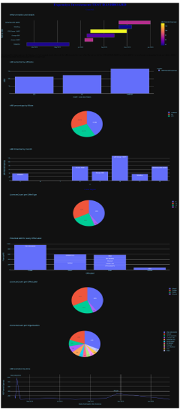

# Dashboarding :Create a dashboard for investement solution
## Environnement:
Microsoft Azure <br />
Serveur CENTOS 8 <br />
## Backend:
  python <br />
  plotly <br />
## Frontend:
Flask <br />
Dash  <br />
## Déploiement:
Gunicorn <br />
## pre-requist:
```bash
pip install dash flask gunicorn <br />
pip install plotly==4.12.0 <br />
```
# Steps:
```
python Dashboard.py <br />
gunicorn Dashboard:server -b :8000 : it will run in port 8000 (you can choose your port) <br />
```
use you prefered navigator and tap : public-ip:8000 <br />

